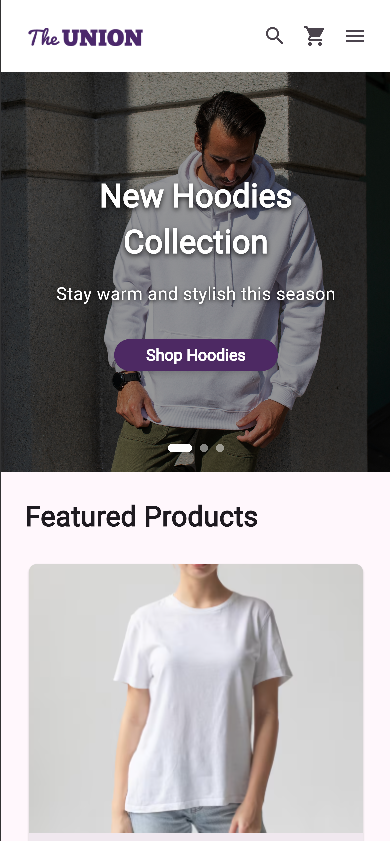
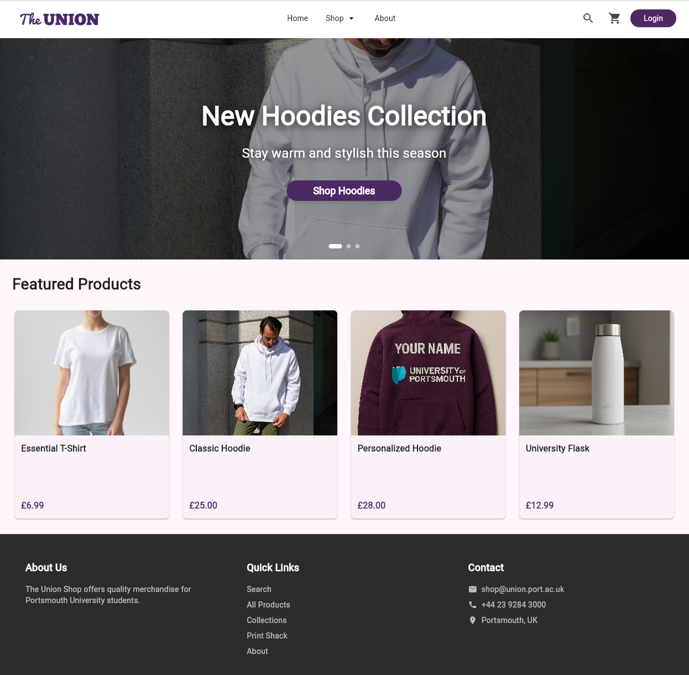
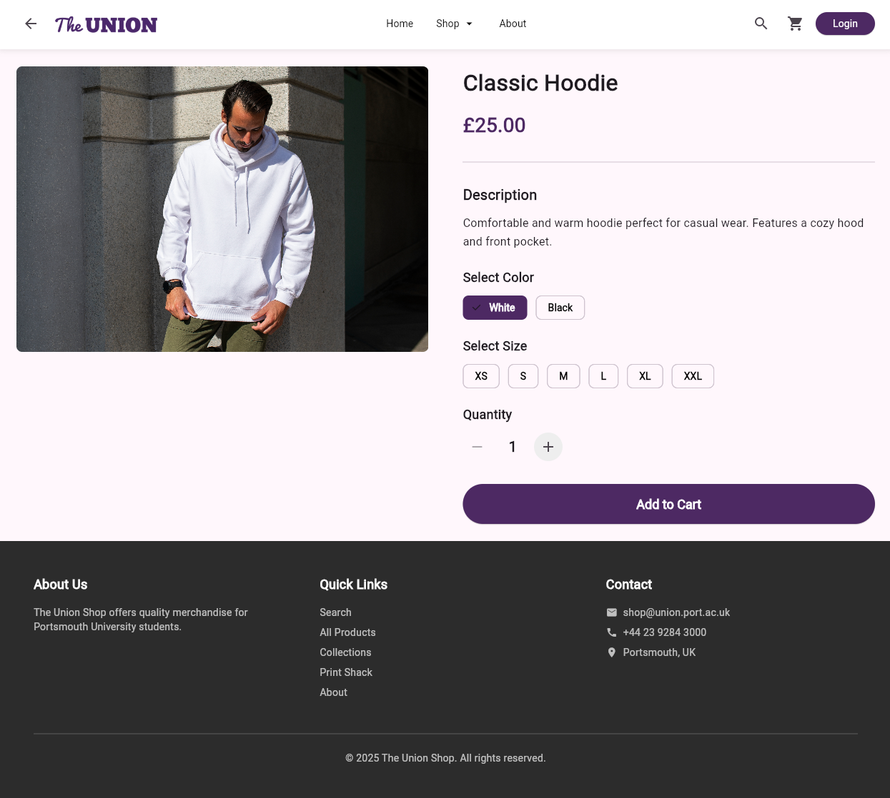
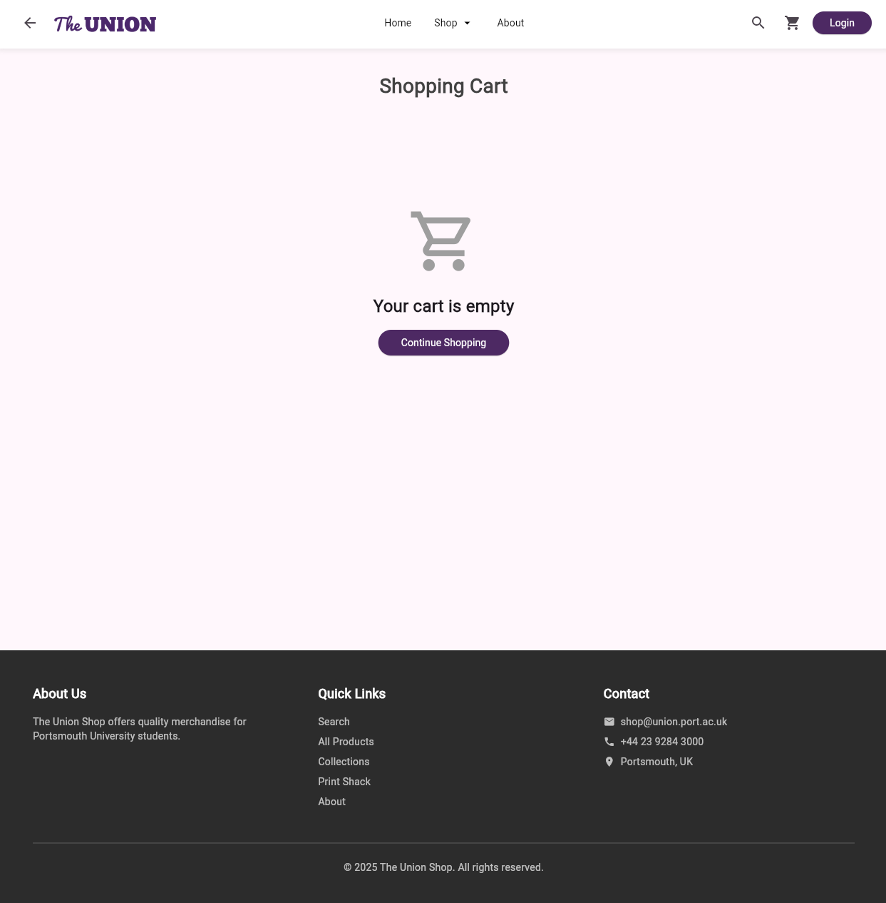
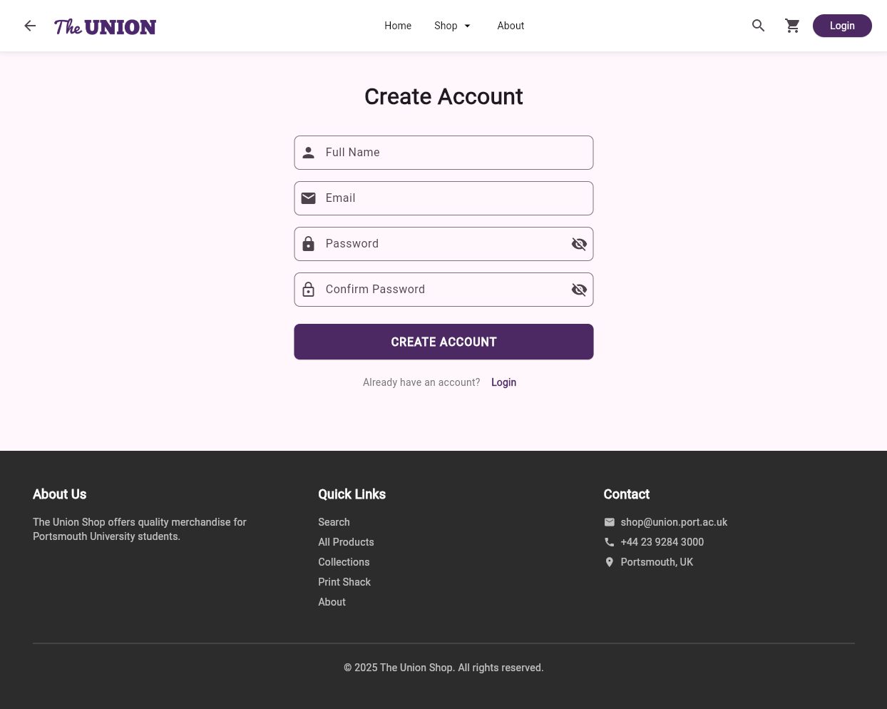

# Union Shop - Flutter E-Commerce Application

A Flutter-based e-commerce application recreating the University of Portsmouth Student Union shop. This project demonstrates modern mobile app development practices with Firebase integration, state management, and comprehensive testing.

## 🚀 Features

### Implemented Features

#### Basic Features
- ✅ **Homepage**: Responsive homepage with featured products and collections
- ✅ **Navigation**: Full navigation system with working navbar and routing
- ✅ **Product Pages**: Dynamic product detail pages with images, descriptions, and pricing
- ✅ **Collections**: Browse products by category/collection
- ✅ **About Page**: Company information and mission statement
- ✅ **Footer**: Consistent footer across all pages with links

#### Intermediate Features
- ✅ **Shopping Cart**: Full cart functionality with add/remove items and quantity management
- ✅ **Authentication**: User login/signup with Firebase Authentication
- ✅ **State Management**: Provider pattern for cart and user state
- ✅ **Responsive Design**: Optimized for both mobile and desktop views
- ✅ **Sale Collection**: Special promotional pages with discounted items

#### Advanced Features
- ✅ **Firebase Integration**: Real-time database and authentication
- ✅ **User Accounts**: Account management with order history
- ✅ **Search Functionality**: Product search across collections
- ✅ **Cart Persistence**: Cart data persists across sessions

## 📱 Screenshots

### Homepage

*Mobile view of the homepage with featured products*


*Desktop responsive layout*

### Product Pages

*Product detail page with size/color options*

### Shopping Cart

*Shopping cart with item management*

### Authentication

*User login interface*


*User registration form*

### Collections

*Product collections overview*


*Individual collection with filters*

### Additional Pages

*About us page*


*Freshers sale promotional page*

## 🛠️ Installation & Setup

### Prerequisites
- Flutter SDK (3.0 or higher)
- Dart SDK (3.0 or higher)
- Git
- A code editor (VS Code recommended)
- Chrome browser (for web testing)

### Getting Started

1. **Clone the repository**
   ```bash
   git clone https://github.com/Creyas/union_shop.git
   cd union_shop
   ```

2. **Install dependencies**
   ```bash
   flutter pub get
   ```

3. **Run the application**
   ```bash
   flutter run -d chrome
   ```

4. **View in mobile mode**
   - Open Chrome DevTools (F12)
   - Click "Toggle device toolbar"
   - Select a mobile device preset (e.g., iPhone 12 Pro)

## 🧪 Testing

This project includes comprehensive widget tests for all major pages and components.

### Run all tests
```bash
flutter test
```

### Run specific test file
```bash
flutter test test/product_test.dart
```

### Run tests with coverage
```bash
flutter test --coverage
```

### Test Files
- `test/home_test.dart` - Homepage tests
- `test/product_test.dart` - Product page tests
- `test/about_test.dart` - About page tests
- `test/all_products_page_test.dart` - All products page tests
- `test/cart_page_test.dart` - Shopping cart tests
- `test/collection_detail_test.dart` - Collection detail tests
- `test/freshers_sale_test.dart` - Sale page tests
- `test/login_signup_test.dart` - Authentication tests

## 🏗️ Project Structure

```plaintext
union_shop/
├── lib/
│   ├── main.dart                    # App entry point and routing
│   ├── pages/
│   │   ├── about.dart              # About page
│   │   ├── all_products_page.dart  # All products listing
│   │   ├── cart_page.dart          # Shopping cart
│   │   ├── collection_detail.dart  # Collection detail view
│   │   ├── freshers_sale.dart      # Sale/promotional page
│   │   ├── login_signup.dart       # Authentication page
│   │   └── product_page.dart       # Product detail page
│   ├── providers/
│   │   └── cart_provider.dart      # Cart state management
│   ├── services/
│   │   └── auth_service.dart       # Firebase authentication
│   └── widgets/
│       ├── header_widget.dart      # Reusable header component
│       └── footer_widget.dart      # Reusable footer component
├── test/
│   ├── about_test.dart
│   ├── all_products_page_test.dart
│   ├── cart_page_test.dart
│   ├── collection_detail_test.dart
│   ├── freshers_sale_test.dart
│   ├── home_test.dart
│   ├── login_signup_test.dart
│   └── product_test.dart
├── screenshots/                     # App screenshots for README
├── pubspec.yaml                     # Project dependencies
└── README.md                        # This file
```

## 🔥 Firebase Integration

This application uses Firebase for backend services:

### Services Used
1. **Firebase Authentication** - User registration and login
2. **Cloud Firestore** - User data and order storage

### Setup Instructions
1. Create a Firebase project at [console.firebase.google.com](https://console.firebase.google.com)
2. Add a web app to your Firebase project
3. Enable Authentication (Email/Password)
4. Enable Cloud Firestore Database
5. Add your Firebase configuration to the app

### Firebase Security
- Authentication required for cart persistence
- User data protected with Firestore security rules
- Secure password reset functionality

## 🌐 Live Demo

[Include link to hosted version if deployed]

**Example:** The application is hosted on Firebase Hosting and can be accessed at: `https://union-shop-xxxxx.web.app`

## 📦 Dependencies

Key packages used in this project:

```yaml
dependencies:
  flutter:
    sdk: flutter
  firebase_core: ^latest
  firebase_auth: ^latest
  cloud_firestore: ^latest
  provider: ^latest

dev_dependencies:
  flutter_test:
    sdk: flutter
  flutter_lints: ^latest
```

## 🎯 Development Practices

### Version Control
- Regular, meaningful commits throughout development
- Clear, descriptive commit messages
- Feature branches for major functionality

### Code Quality
- Properly formatted code (using `dart format`)
- No errors, warnings, or lints
- Well-structured and refactored codebase
- Minimal code repetition

### Testing
- Comprehensive widget tests
- All tests passing
- High code coverage

## 👥 Author

**Your Name**
- GitHub: [@YOUR-USERNAME](https://github.com/YOUR-USERNAME)
- University ID: UPXXXXXX

## 📝 Course Information

**Module**: Programming Applications and Programming Languages (M30235) / User Experience Design and Implementation (M32605)

**Institution**: University of Portsmouth

**Academic Year**: 2024/2025

## 🙏 Acknowledgments

- Original Union Shop website: [shop.upsu.net](https://shop.upsu.net)
- Course materials: [Flutter Course Homepage](https://manighahrmani.github.io/sandwich_shop/)
- University of Portsmouth School of Computing

## 📄 License

This project is created for educational purposes as part of university coursework.

---

**Note**: This is a student project recreating the UPSU shop for educational purposes. It is not affiliated with or endorsed by the University of Portsmouth Students' Union.
